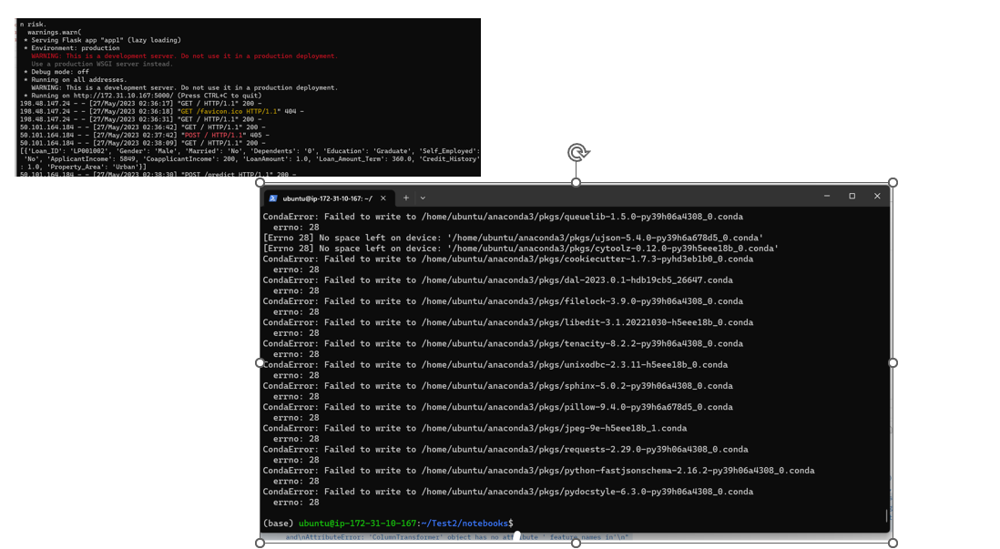

# Mini-project IV

### [Assignment](assignment.md)

## Project/Goals
- EDA
- Cleaning/ selecting features
- Testing models
- Selecting model 
- use pipelines and deployment

## Hypothesis
Scope: The model is for a financial loan institution
Considered hypotheses: 
higher approval rate for:
- Applicants having a credit history 
- Applicants with higher applicant and co-applicant incomes
- Applicants with higher education level
- Properties in urban areas with high growth perspectives
Additional Hypotheses:
Lower approval rate for:
- Applicants self-employed
Same approval rate for:
- Gender and marital status
## EDA Insights
We will focus here on the most important.
### Loan Distributions

#### Loan Amount Distribution
- The distribution is not normal (tested with Shapiro).
- It is skewed to the right with some extreme values
- if we exclude high values, the data seems to be distributed equally between the quartiles
- we will transform this variable with log function to smooth the extreme values
#### Loan Amount Term Distribution
- the mode is 360 months
- we can see for the boxplot all the quartile are flat in the amount above. The rest of the values are like outliers.
### Income Distributions

#### Applicant Income
- The distribution is not normal (tested with Shapiro).
- It is skewed to the right with many extreme values
- if we exclude high values, the data seems to be distributed equally between the quartiles

#### Co-Applicant Income
- The distribution is not normal (tested with Shapiro)
- It is skewed to the right
- The first bin is the mode therefore most co-applicants have a zero income or close to it
- the applicants with a co-applicant with income have a higher percentage of approval

### Categorical Variables 

#### Married Status
- There are more married applicants than not married
- The percentage of approval for married is higher than not-married
- The distribution of Loan amount for Married applicants has more variance however the median seems to be the same. (Requires a hypotheses test for confirmation)

### Gender
- There are more Male applicants than female
- The percentage of approval for female is slightly lower
- The distribution for approved loan amount for male has more variance and we have the loan amounts for 4th quartile male beyond the loan amount distribution (core without outlier for female)
(requires a hypotheses test for confirmation)

### dependents

- Most applicants don't have dependents
- the variances for loan amount distributions increase with the # number of dependents
- No clear trend for loan approval

For ethical concerns, we won't consider above variables separately. We will create a household size variable. 

### Property area
- Semi-urban gets higher approval than urban and Urban slightly higher percentage than rural
- Same order from applications count
-Distributions seems similar visually (Anova test to confirm)

### Self- employed
- Less self-employed applicants than non-self-employed
- It seems no difference in percentage of approval (hypothesis to be confirmed with a test)
- More variance in term of loan amount for non- self employed.

We can ignore this variable, however I decided to keep it for future use as the classes are imbalanced.
### Education
- More applicants education level Graduate
- percentage of approval is higher for the graduate
- More variance for loan amount and income for graduate than non graduate with more high value income for graduate.

### Credit _history

- More applicants with credit history
- percentage of approval is clearly higher for the ones with credit history
- The Amount of loan amount for those with no credit history less than 200K
- Variance higher for loan amount for those with credit history and many extreme values

## Summary based on data visualization
- Applicants having a credit history have higher percentage of approval
- Applicants with higher applicant and co-applicant incomes have higher percentage of approval
- Applicants with higher education level have higher percentage of approval
- Properties in urban areas with high growth perspectives: semi-urban properties have higher percentage of approval

Additional Hypotheses:
- Applicants self-employed have same percentage of approval than others 
- Gender and Marriage status have a slightly different percentage.

## Process
### Cleaning and missing values:
Since we had only 614 records, I didn't want to input any rows. So therefore, I considered the following to fill in missing data
- Gender: the mode =male
- Married: if co-applicant then Y otherwise N
- Dependants :0
- Self-employed: mode=N
- Loan amount: median
- Loan Term: median
- Credit History:0

# features Selection
- Household size = applicant (1)+ Married yes(1)+ dependants(n) with combined 4 and 5 to 4+ since we had only 3+
- Total income = applicant income + co-applicant income
- For ethical concerns Married status, gender and dependent were grouped in Household size

# Models

The data is imbalanced ( Loan_status),, I used the stratify Y as argument for the function split.
We use 2 models for testing Random Forrest and SVC with grid search for best Parameters and optimization of accurracy.

XGBooster was added at the end of the project for personal learning purpose therefore it wasn't considered for the selection.

## Results/Demo
### Random Forest with pipeline results

Note that the recall percentage is lower for 0: It will be wise to consider rerunning the more with f1-score or recall score as criteria to lower the financial institution risk.

#### Demo
Locally: I was able to have the api running locally and with postman

Cloud: the Api is running however I had to trouble many errors to name few:

- Maximum iterations Error
- Version challenges
- finally, during Anaconda update: faced size limitations

My next step: remove Anaconda, replace it with Miniconda and install all the library models
## Challenges 
- AWS limitations
- Time to complete all the tasks

## Future Goals
- Pipeline with XGB classifier (completed refer to XGB file but not deployed)
- Review model best F1 score instead of accuracy to minimise client risk
- Try a sequential model
- More EDA 
- Collect more data from Clients
